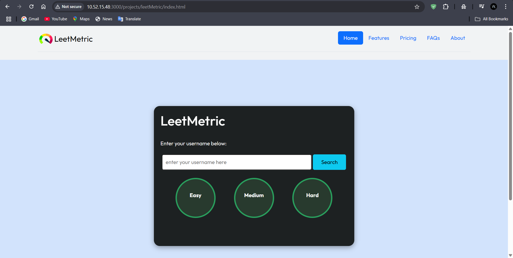
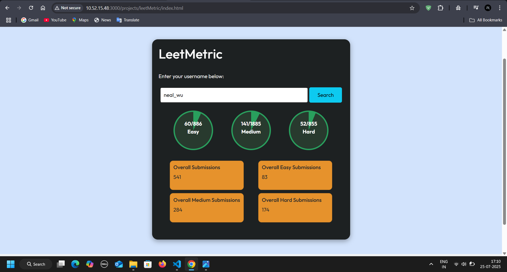

# 🚀 LeetMetric

📊 **LeetMetric** is a simple yet powerful web app that fetches and visualizes your LeetCode profile stats — including Easy, Medium, and Hard problems solved — with clean UI and real-time updates.
 



## 🌟 Features

- 🎯 Real-time LeetCode user stats
- 📈 Animated progress visualization
- ⚡ Built with HTML, CSS, JavaScript & Node.js
- 🔐 Validates real LeetCode usernames
- 🌐 Live demo hosted online

---

## 🔴 Live Demo

🔗 [Click here to try LeetMetric online](https://thunderous-buttercream-2c4e99.netlify.app/)

> Make sure to enter a valid LeetCode username (e.g. `tourist`, `striver79`).

---

## 📂 Project Structure
leetmetric/
├── index.html # Frontend layout
├── script.js # LeetCode API logic
├── server.js # Express.js backend proxy
├── styles.css # Custom styling
└── assets/ # Screenshots or preview 


---

## 🛠️ How to Run Locally

1. Clone the repo:
   ```
   git clone https://github.com/singhbalendu211/LeetMetric.git
   ```
2. Start the backend server
   ```
   cd LeetMetric
   npm install express axios cors
   node server.js
   ```
3. Open index.html in browser

📦 Tech Stack
Frontend: HTML, CSS, JavaScript
Backend: Node.js (Express.js proxy server)
API: LeetCode GraphQL API

🙌 Contribution
Contributions, issues, and feature requests are welcome!
Feel free to fork and ⭐ the repo if you like it.

📄 License
MIT License ©singhbalendu211
   


